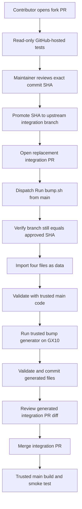

# Contributor CI security workflow

This document explains how contributions reach the GX10 runners without
automatically executing contributor code on persistent hardware.

## Security objective

Pull requests from forks must be useful and testable without receiving secrets,
write credentials, or access to a self-hosted runner.

The GX10 bump workflow treats contributor changes as untrusted. It imports only
four reviewed files as declarative data:

- `versions.env`
- `Dockerfile`
- `locks/apt-sources.list`
- `locks/apt-packages.txt`

`Dockerfile` is imported only so its content hash can affect `GB10_BUILD`. Its
instructions are not executed by the bump workflow.

All validators, `scripts/bump.sh`, and lockfile policy tests executed on GX10
come from the exact `main` commit that defined the manually dispatched
workflow.

## End-to-end flow



The original fork PR is not merged after promotion. The integration PR becomes
the merge candidate because it contains the generated SHAs, build number, and
lockfiles.

## Trust boundaries

| Component | Trust level | Where it runs |
|---|---|---|
| Contributor repository code | Untrusted | GitHub-hosted PR runner only |
| Four imported build-input files | Untrusted data with strict validation | Trusted generator worktree |
| Workflow and generator scripts | Exact trusted `main` SHA | GX10 runner |
| Generated lockfiles | Untrusted output until reviewed | Integration PR |
| Write token | Trusted workflow steps only | GX10 runner after no contributor code has executed |
| Merged `main` code | Trusted by repository review policy | GX10 build and smoke-test jobs |

The workflow does not sandbox arbitrary code that a maintainer has merged.
Containing malicious code that passed review requires ephemeral or separately
isolated GX10 runners.

## Automated release monitor

The release monitor treats upstream release metadata and requirements files as
untrusted data. Processing that data happens in a read-only GitHub-hosted job
with no repository secrets. The job uploads only a candidate `versions.env`.

Pull request creation runs on a fresh GitHub-hosted runner. Before the release
monitor PAT is available to any step, trusted code from the exact triggering
`main` SHA checks that the candidate:

- is a valid `versions.env`;
- changes at least one monitored value;
- changes only the release monitor's explicit key allowlist;
- preserves every comment, line, and non-monitored value byte-for-byte.

Only the validated `versions.env` is copied into the trusted checkout. The PR
action is pinned by full commit SHA, commits only `versions.env`, and receives
an explicit `main` base because the trusted checkout intentionally uses a
detached exact SHA.

This fresh-runner boundary is required even when the upstream parser validates
its output. It prevents a parser defect or compromised upstream response from
modifying a repository script and then reaching a later step that has the PAT.

PR creation is not the final monitor acceptance gate. The generated PR must
pass hosted CI with the candidate already applied, then pass the trusted bump
handoff before merge. See
[Automated release monitor lifecycle](../CONTRIBUTING.md#automated-release-monitor-lifecycle).

## Maintainer runbook

### 1. Review the fork PR

Review the complete diff, not only `versions.env`. Record the exact 40-character
head SHA. Any subsequent contributor push requires another review.

GitHub-hosted checks must pass before promotion.

### 2. Promote the reviewed commit

Fetch the fork PR through the upstream repository and create an integration
branch at the exact reviewed commit:

```bash
git fetch origin pull/62/head
git switch -c integration/pr-62 FETCH_HEAD
git rev-parse HEAD
git push -u origin integration/pr-62
```

Confirm that `git rev-parse HEAD` equals the SHA reviewed in step 1.

Open a replacement PR from `integration/pr-62` to `main`. Link the original
fork PR in its description so authorship and discussion remain discoverable.

### 3. Dispatch the trusted bump workflow

In GitHub Actions:

1. Open **Run bump.sh**.
2. Select `main` as the workflow ref.
3. Enter `integration/pr-62` as the branch.
4. Enter the exact 40-character reviewed SHA.
5. Start the workflow.

The workflow stops before generation if the branch no longer points to that
SHA.

### 4. Review generated changes

After the workflow pushes its generated commit, review:

- resolved NCCL, vLLM, and FlashInfer commit SHAs;
- the CUDA image digest;
- `GB10_BUILD`;
- every package version and hash change;
- apt snapshot and package changes;
- any unexpected change outside the contributor's stated purpose.

Random temporary filenames are normalized, so path-only lockfile noise should
not appear.

### 5. Merge the integration PR

Merge the integration PR only after required GitHub-hosted checks pass and the
generated diff has been reviewed. Close the original fork PR with a link to the
integration PR.

This repository currently has one collaborator. GitHub does not allow a pull
request author to approve their own pull request, so maintainer-authored pull
requests require the repository administrator bypass. Use that bypass only
after the required check passes and the complete diff has been reviewed. Never
use the bypass for an external contributor's pull request. External changes
must be promoted to an integration branch, receive the maintainer's code-owner
approval after the final generated commit, and pass all required checks.

The push to `main` starts the GX10 image build and smoke test.

## Validation policy

`versions.env` permits only:

- approved upstream repository URLs;
- approved Python package indexes;
- the NVIDIA CUDA devel image family for Ubuntu 24.04;
- exact commit SHAs and image digests;
- released tag and exact numeric version formats;
- the supported GB10 architecture values;
- a bounded non-negative build number.

Apt inputs permit only the expected Ubuntu snapshot host, one midnight UTC
snapshot timestamp, the three expected Noble suites, and package-name syntax
that cannot be interpreted as command-line options.

Generated Python lockfiles must use exact versions and SHA-256 hashes. Editable
requirements, local paths, direct URLs, Git requirements, and alternate indexes
are rejected.

## Changes outside the bump data model

Changes to workflows, scripts, tests, or Dockerfile instructions are preserved
in the integration PR, but they are not executed by `run-bump.yaml`.

There is no safe pre-merge GX10 execution path for arbitrary contributor code
on the persistent runners. These changes rely on GitHub-hosted tests, exact-diff
review, CODEOWNERS, and repository branch protections. The hardware build and
smoke test run after merge from trusted `main`.

## Expected failure modes

| Failure | Meaning | Response |
|---|---|---|
| Branch SHA mismatch | Integration branch moved after approval | Review the new SHA and dispatch again |
| Input validation failure | A build input is malformed or outside policy | Correct the PR or intentionally update trusted policy |
| Lockfile policy failure | Resolver produced an unsafe requirement form | Investigate upstream input before proceeding |
| Unexpected generated path | Generator changed something outside its output allowlist | Treat as a workflow bug or compromise signal |
| Push rejected | Branch moved while generation was running | Review the new branch head and rerun |
| Action SHA not approved | `test_all_external_actions_are_pinned_by_full_sha` failed because `tests/test-ci-security-policy.py` has a different SHA for the action | Review the upstream action's release notes between the old and new SHA. If the change is safe (e.g., a routine upstream maintenance release from the official publisher), update the `APPROVED_ACTIONS` entry in `tests/test-ci-security-policy.py` to match the new SHA and push to the PR branch. Dependabot opens these PRs automatically; the test is the review gate. Never approve a new SHA without understanding what changed. |

## Required repository settings

The repository configuration must enforce the controls that files cannot:

- require pull requests for `main`;
- require the GitHub-hosted test workflow;
- require CODEOWNERS review for sensitive paths;
- dismiss stale approvals when new commits are pushed;
- reserve administrator bypass for maintainer-authored pull requests;
- limit workflow dispatch and integration-branch pushes to maintainers;
- never assign public fork jobs to self-hosted runners.

CODEOWNERS has no enforcement effect unless the branch protection rules require
code-owner review.
